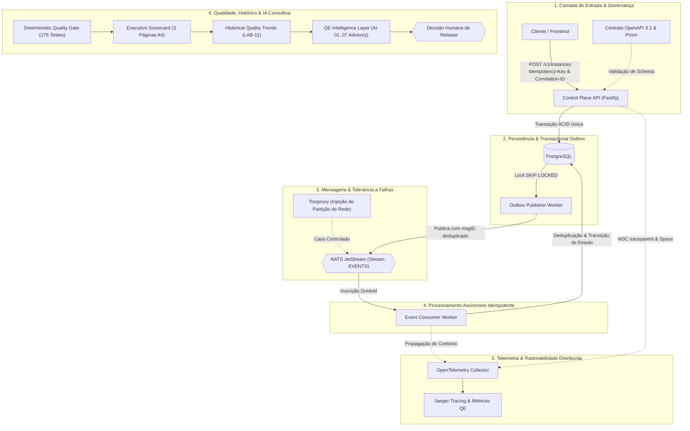

# TOTVS Cloud QE Lab

> **[LAB] Laboratório Avançado de Quality Engineering para Plataformas Cloud**  
> *Projeto pessoal, público, experimental e **não oficial**. Não representa a arquitetura, os processos, os controles, os dados ou as decisões da TOTVS.*

[](evidence/scorecard/scorecard.html)
[](docs/00-charter.md)
[](evidence/scorecard/current.json)
[-success?style=flat-square)](evidence/history/trends.json)
[](docs/ai-assisted-impact-analysis.md)

---

## 1. Visão Geral Executiva

O **TOTVS Cloud QE Lab** é uma implementação de referência de **Engenharia de Qualidade (QE)** aplicada a microsserviços e plataformas de computação em nuvem com alta concorrência e processamento assíncrono.

Em vez de focar apenas em testes automatizados superficiais, o laboratório materializa a governança de ponta a ponta orientada a riscos reais de sistemas distribuídos:

```text
Risco de Negócio  ──>  Controle Técnico  ──>  Evidência Auditável  ──>  Decisão Humana
```

### Pilares Fundamentais:
1. **Determinismo Absoluto**: 175 testes automatizados (129 unitários e baseados em propriedades, 17 de contrato/API/segurança e testes de integração em containers) com **0 testes flaky**.
2. **Resiliência Assíncrona**: Garantias de consistência eventual, idempotência atômica e Transactional Outbox com NATS JetStream e PostgreSQL.
3. **Shift-Left Security & Observabilidade**: SAST, Secret Scan, DAST (OWASP ZAP) e rastreabilidade distribuída completa com OpenTelemetry (W3C TraceContext).
4. **Governança Executiva**: Scorecard diagramado em 3 páginas A4 landscape para diretoria e análise determinística de tendências históricas (LAB-11).
5. **IA Consultiva Segura**: 7 módulos de inteligência assistiva (AI-01 a AI-07) com validação estrita via Zod, fallbacks seguros e **zero autoridade de release autônoma**.

---

## 2. Arquitetura do Sistema & Pipeline de Qualidade

O sistema sob teste é um Cloud Control Plane assíncrono para provisionamento e gestão de instâncias computacionais em nuvem:



---

## 3. Matriz de Capacidades de Engenharia de Qualidade (QE)

O laboratório consolida 12 capacidades demonstradas com controles executáveis e evidências em JSON:

| ID | Capacidade Técnica | Risco Mitigado | Controle Executável | Evidência Principal |
| :--- | :--- | :--- | :--- | :--- |
| **CAP-01** | [Governança de Contratos OpenAPI](docs/14-qe-capability-map.md#cap-01) | `RISK-API-001` (Breaking Changes) | `CTRL-CONTRACT-001` (Ajv + Prism) | `evidence/test-results/contract.json` |
| **CAP-02** | [Idempotência & Concorrência](docs/14-qe-capability-map.md#cap-02) | `RISK-API-005` (Faturamento Duplicado) | `CTRL-IDEMPOTENCY-001` (Replay) | `evidence/test-results/api.json` |
| **CAP-03** | [Transactional Outbox Pattern](docs/14-qe-capability-map.md#cap-03) | `RISK-OUTBOX-001` (Perda de Eventos) | `CTRL-OUTBOX-ATOMIC-001` (ACID) | `evidence/test-results/unit.json` |
| **CAP-04** | [Testes de Propriedades (PBT)](docs/14-qe-capability-map.md#cap-04) | `RISK-SEC-005` (Malformed Payloads) | `CTRL-REQUEST-001` (`fast-check`) | `evidence/test-results/unit.json` |
| **CAP-05** | [Observabilidade Distribuída](docs/14-qe-capability-map.md#cap-05) | `RISK-OBS-001` (Spans Quebrados) | `CTRL-OBS-TRACE-TREE-001` (OTel) | `evidence/observability/trace-summary.json` |
| **CAP-06** | [Visibilidade de Erros em Filas](docs/14-qe-capability-map.md#cap-06) | `RISK-OBS-004` (Gargalo Silencioso) | `CTRL-OBS-NATS-ERROR-VISIBILITY-001` | `evidence/observability/trace-summary.json` |
| **CAP-07** | [Resiliência a Caos & Partições](docs/14-qe-capability-map.md#cap-07) | `RISK-RES-001` (Queda de Broker) | `CTRL-RES-NATS-OUTAGE-001` (Toxiproxy) | `evidence/resilience/chaos-report.json` |
| **CAP-08** | [Jornadas Sintéticas E2E](docs/14-qe-capability-map.md#cap-08) | `RISK-JOURNEY-001` (Quebra de SLA) | `CTRL-JOURNEY-PROVISIONING-001` | `evidence/test-results/journey.json` |
| **CAP-09** | [Baseline de Performance](docs/14-qe-capability-map.md#cap-09) | `RISK-PERF-001` (Regressão de Latência) | `CTRL-PERF-LATENCY-001` (k6) | `evidence/performance/baseline.json` |
| **CAP-10** | [Segurança Shift-Left & DAST](docs/14-qe-capability-map.md#cap-10) | `RISK-SEC-001` (Vazamento de Chaves) | `CTRL-SEC-SECRET-001` (Gitleaks/ZAP) | `evidence/security/summary.json` |
| **CAP-11** | [Scorecard Executivo A4](docs/14-qe-capability-map.md#cap-11) | N/A (Desalinhamento com Negócio) | `CTRL-SCORECARD-GATE-001` | `evidence/scorecard/scorecard.html` |
| **CAP-12** | [Histórico de Qualidade & IA](docs/14-qe-capability-map.md#cap-12) | N/A (Acúmulo de Dívida Técnica) | `CTRL-HISTORY-TREND-001` (LAB-11) | `evidence/history/trends.json` |

---

## 4. Início Rápido (Execução Local em 3 Comandos)

Pré-requisitos: Node.js 20+ LTS, npm e Docker com Docker Compose.

```bash
# 1. Instalar dependências
npm ci

# 2. Subir infraestrutura (PostgreSQL, NATS JetStream, Toxiproxy, OTel Collector, Jaeger)
docker compose -f infra/docker-compose.yml up -d --wait

# 3. Executar verificação determinística e gerar Scorecard
npm run verify
```

### Comandos de Teste Específicos:
```bash
npm run test:unit            # 129 testes unitários e testes baseados em propriedades (PBT)
npm run test:api             # Testes comportamentais de API, idempotência e concorrência
npm run test:contract        # Validação estrita de contratos OpenAPI 3.1
npm run test:security        # Scanners SAST, Secret Scan, Dependências e DAST
npm run test:performance     # Verificação de latência e throughput contra baseline k6
npm run test:journeys        # Jornadas sintéticas ponta a ponta do usuário
npm run test:resiliency      # Injeção de partições de rede e falhas de workers
npm run test:observability   # Validação de rastreamento distribuído e spans W3C
```

### Geração de Scorecard e Histórico:
```bash
npm run history:snapshot     # Registra snapshot determinístico da execução atual
npm run history:build        # Processa série histórica e calcula tendências (LAB-11)
npm run scorecard            # Gera relatório executivo A4 em JSON, HTML e PDF
```

---

## 5. Governança de IA Assistiva (AI-01 a AI-07)

A camada de inteligência artificial foi desenhada sob rígidos princípios de confiabilidade corporativa:

```text
Entrada (Diff Git / OpenAPI / Evidência JSON)
  │
  ▼
Validação de Schema Pré-LLM (Zod)
  │
  ▼
Execução LLM (Gemini API / OpenAI Substituível)
  │
  ▼
Validação Estrita de Saída (Zod Schema Parsing)
  │
  ├──> Sucesso: Relatório Advisory (Sugestões, Gaps, Riscos Impactados)
  └──> Falha / Timeout / Sem Chave: Fallback Determinístico Seguro (AI_*_UNAVAILABLE)
```

- **Aconselhamento Exclusivo (Advisory Only)**: A IA **nunca** aprova releases, não altera gates e não toma ações autônomas no cluster.
- **Isolamento de Credenciais**: Nenhuma chave de API ou segredo corporativo trafega para os modelos.

---

## 6. Classificação Obrigatória de Domínio

Para assegurar conformidade ética e clareza de escopo, todas as afirmações seguem taxonomia estrita:

| Marcador | Significado | Aplicação |
| :--- | :--- | :--- |
| `[PUB]` | Informação Pública Confirmada | Conteúdos oficiais extraídos de documentações públicas e citadas. |
| `[VAGA]` | Informação do Perfil da Vaga | Requisitos e tecnologias descritas no anúncio público de contratação. |
| `[LAB]` | Decisão do Laboratório | Escolhas arquiteturais, mocks e cenários criados para este projeto experimental. |
| `[VALIDAR]` | Hipótese Pendente | Questões que dependem de confirmação técnica após onboarding no cliente. |

---

## 7. Índice Completo da Documentação

### Documentos Fundamentais
- [00 - Charter & Governança](docs/00-charter.md)
- [01 - Mapa Público do Produto](docs/01-public-product-map.md)
- [02 - Assumption Register](docs/02-assumptions.md)
- [04 - Mapa de Riscos Exercitados](docs/04-quality-risk-map.md)

### Manuais Técnicos de Engenharia
- [05 - Outbox Pattern & NATS JetStream](docs/05-outbox-nats.md)
- [06 - Modelo de Falhas Distribuídas & Resiliência](docs/06-distributed-failure-model.md)
- [07 - Observabilidade & Telemetria Distribuída](docs/07-observability-telemetry.md)
- [08 - Jornadas Sintéticas E2E & SLAs](docs/08-synthetic-journeys.md)
- [09 - Performance Contínua & Baselines](docs/09-performance-baseline.md)
- [10 - Executive Quality Scorecard A4](docs/10-executive-quality-scorecard.md)
- [11 - Security Quality Pack & DAST](docs/11-security-quality-pack.md)
- [12 - Historical Quality Trends (LAB-11)](docs/12-historical-quality-trends.md)

### Pacote Executivo & Portfólio (LAB-12)
- [13 - Arquitetura Consolidada do Sistema](docs/13-final-architecture.md)
- [14 - Mapa de Capacidades de QE](docs/14-qe-capability-map.md)
- [15 - Narrativa Executiva para Liderança](docs/15-executive-narrative.md)
- [16 - Playbook de Onboarding & Adaptação](docs/16-onboarding-adaptation-playbook.md)
- [17 - Roteiro de Demonstração Técnica (11 Passos)](docs/17-demo-script.md)
- [18 - Resumo Executivo para Portfólio](docs/18-portfolio-summary.md)
- [19 - Matriz Consolidada de Qualidade](docs/19-final-quality-matrix.md)
- [IA Assistiva - Arquitetura de Impact Analysis](docs/ai-assisted-impact-analysis.md)

---

## 8. Status do Escopo: LAB SCOPE COMPLETE

> **Declaração Formal de Fechamento de Escopo [LAB]**  
>  
> O ciclo completo de desenvolvimento e validação do laboratório encontra-se formalmente **CONCLUÍDO E CONGELADO** (`LAB SCOPE COMPLETE`).
>  
> Foram entregues com êxito os 12 ciclos de Engenharia de Qualidade (**LAB-01 a LAB-12**) e os 7 módulos de Inteligência Assistiva (**AI-01 a AI-07**), consolidando um acervo demonstrativo completo, determinístico e auditável.
