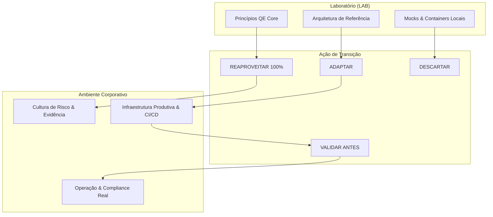

# Playbook de Onboarding & Adaptação para Cloud QE [LAB]

> **Aviso de Domínio**: Este documento é parte de um laboratório pessoal, público e experimental (`totvs-cloud-qe-lab`). Não representa processos, políticas internas ou SLAs oficiais da TOTVS. Marcador de domínio: `[LAB]`.

---

## 1. Contexto & Propósito

Ao assumir a responsabilidade de Engenharia de Qualidade (QE) em uma plataforma ou tribo Cloud corporativa, o principal desafio não é a escolha de ferramentas, mas a conexão entre **risco de negócio**, **controles automatizados**, **evidências auditáveis** e **decisão humana governada**.

Este playbook estabelece um roteiro estruturado para os primeiros 30 a 90 dias, orientando o Especialista de Qualidade a diagnosticar a maturidade da engenharia, mapear riscos reais de arquitetura distribuída e adaptar os pilares demonstrados no laboratório para a realidade da organização.

---

## 2. Fase de Descoberta (Primeiros 30 Dias)

A fase de descoberta tem como objetivo construir o mapa de dependências e riscos antes de qualquer alteração de pipeline ou escrita de testes.

```
Dia 01-10: Mapeamento de Arquitetura & Fluxo de Valor
Dia 11-20: Entrevistas com Stakeholders & Levantamento de Dores
Dia 21-30: Avaliação de Ferramental, Telemetria & Baseline de Qualidade
```

### 2.1. O que Perguntar e a Quem Perguntar

| Stakeholder | Perguntas-Chave | O que Observar / Validar |
| :--- | :--- | :--- |
| **Cloud Architects & Tech Leads** | - Como os serviços se comunicam (síncrono vs assíncrono)?<br>- Como idempotência e consistência eventual são garantidas?<br>- Qual é a estratégia de particionamento e outbox? | Diagramas de arquitetura vigentes vs código real; existência de Dead Letter Queues (DLQ) e garantias transacionais. |
| **SRE & DevOps** | - Quais são os SLOs/SLIs reais de produção?<br>- Quais foram os últimos 3 incidentes críticos (P1/P2)?<br>- Como métricas, traces e logs são correlacionados? | Dashboards de Grafana/Datadog; taxa de erros por serviço; tempo médio de recuperação (MTTR); alarmes ruidosos. |
| **Product Managers & Business** | - Qual é o impacto financeiro de 1 hora de indisponibilidade?<br>- Quais jornadas de usuário geram maior faturamento?<br>- Qual é a tolerância a atraso no processamento? | SLAs contratuais com clientes; períodos de pico (ex: fechamento contábil, Black Friday); fluxos core. |
| **Security & Compliance** | - Quais scanners rodam no pipeline (SAST, SCA, DAST, Secret)?<br>- Como credenciais e chaves transitam no cluster?<br>- Quais são os requisitos regulatórios (LGPD, SOC2, PCI)? | Políticas de imagem de container; gestão de secrets (Vault/KMS); relatórios de auditoria pendentes. |

---

## 3. Matriz de Adaptação: O que Reaproveitar, Adaptar, Descartar e Validar

O laboratório foi desenhado com arquitetura de referência desacoplada. A transição para um ambiente corporativo segue o seguinte enquadramento:



### 3.1. O que REAPROVEITAR Diretamente

1. **Cadeia Risco -> Controle -> Evidência -> Decisão**:
   - Manter a regra pétrea de que nenhum teste existe sem risco mapeado, e nenhum release ocorre sem evidência auditável.
2. **Playwright Annotations Governamentais**:
   - Uso de tags explícitas em código (`risk_id`, `risk`, `control_id`, `control`) para vincular casos de teste diretamente ao catálogo de riscos.
3. **Padrão OpenTelemetry com Correlation IDs**:
   - Propagação de W3C TraceContext (`traceparent`) e `x-correlation-id` entre APIs, brokers de mensageria e workers.
4. **Layout Executivo de Scorecard A4**:
   - Preservar o relatório denso, visual e sem rolagem em 3 páginas A4 landscape para consumo de diretoria e auditoria.
5. **Governança de IA Consultiva com Validação Estrita (Zod)**:
   - Manter schemas Zod para parsing de respostas de LLMs, fallbacks determinísticos (`AI_*_UNAVAILABLE`) e impedimento total de ação autônoma ou bloqueio de gates.

### 3.2. O que ADAPTAR

1. **Substituição de Mocks por Serviços Reais / Staging**:
   - Substituir `apps/control-plane-mock` por endpoints de ambientes de homologação (Staging/Sandbox), utilizando geradores de contratos OpenAPI para manter alinhamento.
2. **Scanners e Ferramental de Segurança**:
   - Conectar os controles de DAST do laboratório (OWASP ZAP container) à infraestrutura de segurança corporativa (SonarQube, Veracode, Checkmarx, Wiz, Prisma Cloud).
3. **Orquestração de CI/CD**:
   - Converter os workflows de GitHub Actions para a esteira oficial da empresa (GitLab CI, Azure DevOps, Jenkins ou Harness), preservando os mesmos passos de validação (`lint`, `audit`, `typecheck`, `test`, `scorecard`).
4. **Backend de Observabilidade**:
   - Apontar o OpenTelemetry Collector (`infra/otel-collector-config.yaml`) para o cluster corporativo gerenciado (Grafana Cloud, Datadog, Dynatrace, New Relic, Tempo/Loki).

### 3.3. O que DESCARTAR

1. **Docker Compose Local para Orquestração Produtiva**:
   - Descartar os manifests de `docker-compose.yml` para implantação; adotar manifests Kubernetes, Helm Charts ou Kustomize conforme o padrão da engenharia de infraestrutura.
2. **Workers em Processo Único Local**:
   - Descartar o runner de consumo mockado em Node.js; adotar deployments com Horizontal Pod Autoscaler (HPA) e escalonamento orientado a métricas de fila (KEDA).
3. **Dados Sintéticos Simplificados**:
   - Descartar seeds estáticos; implementar geradores de massas de dados mascaradas e alinhadas a padrões LGPD.

### 3.4. O que VALIDAR Antes de Tocar em Produção

1. **SLOs e Tolerância de Latência Reais**:
   - `[VALIDAR]` se os thresholds do laboratório (ex: p95 < 200ms) condizem com a realidade da rede e infraestrutura de produção multi-tenant.
2. **Topologias de Mensageria e Confiabilidade**:
   - `[VALIDAR]` políticas de retenção de mensagens, partições, dead-letter exchanges e timeouts configurados nos clusters de mensageria corporativos (Kafka, RabbitMQ, NATS JetStream).
3. **IAM, RBAC e Governança de Rede**:
   - `[VALIDAR]` autenticação via mTLS, tokens OAuth2/OIDC corporativos e políticas de rede (NetworkPolicies) entre pods e VPCs.
4. **Compliance Regulatório e Trilha de Auditoria**:
   - `[VALIDAR]` tempo de retenção obrigatório para os relatórios de scorecard e evidências de qualidade perante auditorias externas.

---

## 4. Framework de Priorização de Riscos de Qualidade

Para evitar a dispersão de esforço em cenários de baixa probabilidade ou baixo impacto, deve-se aplicar a matriz de priorização de QE:

| Prioridade | Critério | Ação Imediata de QE | Exemplo no Lab |
| :--- | :--- | :--- | :--- |
| **P0 (Crítico)** | Corrupção de dados, falha de idempotência, vazamento de segredos, indisponibilidade total do pipeline de billing/pedido. | Controle determinístico automatizado no gate bloqueante (PBT, Idempotência, Secret Scan). | `RSK-IDEMP-01`, `RSK-SEC-03` |
| **P1 (Alto)** | Regressão de latência p95 > 25%, timeout em chamadas assíncronas, falha de contrato OpenAPI, falha de schema em eventos. | Testes de contrato OpenAPI (Ajv/SwaggerParser/Pact) e testes de carga baseline com asserção estrita no CI. | `RSK-PERF-01`, `RSK-ASYNC-01` |
| **P2 (Médio)** | Degradamento de resiliência (reconexão lenta de broker), headers de segurança ausentes, logs sem correlação. | Alertas em ambiente de staging, validação de headers e testes de resiliência periódicos. | `RSK-RESIL-01`, `RSK-SEC-01` |
| **P3 (Baixo)** | Inconsistências cosméticas de documentação, warnings de dependências sem vulnerabilidade explorável. | Linters estáticos, sugestões consultivas de IA via PR, dívida técnica priorizada em backlog. | `AI-01`, `AI-02` |

---

## 5. Roteiro dos Primeiros 90 Dias

```
Dias 01 - 30: Diagnóstico & Mapeamento
- Levantamento de riscos com liderança técnica e SRE.
- Instrumentação de telemetria básica (Correlation ID + OpenTelemetry).
- Criação do Catálogo de Riscos unificado.

Dias 31 - 60: Implantação de Controles Fundamentais
- Implantação de testes de contrato OpenAPI / Schema validation.
- Implementação de testes de idempotência e concorrência para endpoints críticos.
- Automação do primeiro Scorecard de Qualidade no CI.

Dias 61 - 90: Evolução, Histórico & IA Consultiva
- Estabelecimento do baseline de performance e testes de resiliência de broker.
- Ativação do histórico de qualidade (Quality Trends) para acompanhamento sprint a sprint.
- Integração de agentes de IA consultiva (Impact Analysis) para acelerar code reviews.
```
