# Roteiro de Demonstração Técnica (Demo Script) [LAB]

> **Aviso de Domínio**: Este documento é parte de um laboratório pessoal, público e experimental (`totvs-cloud-qe-lab`). Não representa processos, políticas internas ou apresentações oficiais da TOTVS. Marcador de domínio: `[LAB]`.

---

## 1. Visão Geral da Demonstração

- **Duração Estimada**: 10 a 15 minutos.
- **Público-Alvo**: Liderança de Engenharia (Diretores/Gerentes/Staff+), Arquitetos Cloud, Especialistas de QA e Times de SRE/DevOps.
- **Objetivo**: Demonstrar de forma prática a engenharia de qualidade aplicada a microsserviços Cloud, partindo do risco de negócio até a governança de IA consultiva e o scorecard executivo.
- **Princípio Central**: `Risco -> Controle -> Evidência -> Decisão humana`.

---

## 2. Roteiro Passo a Passo (11 Etapas)

```mermaid
graph LR
    A[1. Charter & Contexto] --> B[2. Arquitetura Cloud]
    B --> C[3. Contratos OpenAPI]
    C --> D[4. Pirâmide de Testes & PBT]
    D --> E[5. Consistência & Idempotência]
    E --> F[6. Observabilidade & OTel]
    F --> G[7. Shift-Left Security]
    G --> H[8. Performance & Caos]
    H --> I[9. Scorecard A4]
    I --> J[10. Tendências Históricas]
    J --> K[11. IA Consultiva Governança]
```



---

### Passo 1: Contexto Executivo & Charter Governança
- **Comando / Ação**:
  Exibir `docs/00-charter.md` e a tabela de taxonomia em `README.md`.
- **O que Mostrar**:
  - A separação estrita de escopo por marcadores de domínio: `[PUB]` (fontes públicas), `[VAGA]` (requisitos da vaga), `[LAB]` (decisões do laboratório) e `[VALIDAR]` (hipóteses a confirmar).
  - O ciclo fechado e completo de **LAB-01 a LAB-12** e **AI-01 a AI-07**, formalizando o status `LAB SCOPE COMPLETE`.
- **Mensagem-Chave**:
  "Engenharia de qualidade começa com limites de escopo e governança clara. Este laboratório não faz suposições desgovernadas sobre a TOTVS e foca exclusivamente em excelência técnica aplicável a qualquer Cloud corporativa."

---

### Passo 2: Arquitetura & Infraestrutura de Referência
- **Comando / Ação**:
  Exibir `docs/13-final-architecture.md` e o arquivo `infra/docker-compose.yml`.
- **O que Mostrar**:
  - A esteira desacoplada: API Control Plane -> PostgreSQL (Transactional Outbox) -> NATS Message Broker -> Background Consumer -> OTel Collector.
- **Mensagem-Chave**:
  "Qualidade em microsserviços exige entender e testar a topologia real: comunicação assíncrona, tolerância a falhas e desacoplamento de persistência."

---

### Passo 3: Contratos OpenAPI & Mock Determinístico
- **Comando / Ação**:
  ```bash
  npm run test:contract
  ```
- **O que Mostrar**:
  - Execução dos testes de contrato validando a especificação `specs/openapi/cloud-control-plane.yaml` contra o mock de referência.
  - Validação estrita de tipos, status HTTP e schemas via Ajv e SwaggerParser.
- **Mensagem-Chave**:
  "O contrato OpenAPI é a verdade canônica do laboratório. Nenhuma divergência de status, campos ou erros passa despercebida no pipeline."

---

### Passo 4: Pirâmide Determinística de Testes & PBT
- **Comando / Ação**:
  ```bash
  npm run test:unit
  ```
- **O que Mostrar**:
  - Execução de 130 testes unitários rápidos e determinísticos com `node:test` via `tsx --test`.
  - Testes baseados em propriedades (Property-Based Testing) com `fast-check` exercitando milhares de permutações de payloads sem flaky tests.
  - Anotações Playwright padronizadas com tags `risk_id`, `risk`, `control_id` e `control`.
- **Mensagem-Chave**:
  "Todo teste declara expressamente qual risco de negócio está mitigando. Testes sem risco mapeado são eliminados."

---

### Passo 5: Consistência Assíncrona & Idempotência
- **Comando / Ação**:
  Exibir `apps/control-plane-mock/src/consumer.ts` e executar:
  ```bash
  npm run test:api
  ```
- **O que Mostrar**:
  - Testes de idempotência: requisições com a mesma chave `Idempotency-Key` e mesmo payload retornam resultado idêntico (HTTP 200/201) sem duplicação no banco.
  - Requisições com a mesma chave e payload divergente disparam conflito explícito (HTTP 409).
- **Mensagem-Chave**:
  "Em sistemas distribuídos, a rede falhará. A garantia de idempotência no Transactional Outbox protege contra faturamento duplicado e corrupção de estado."

---

### Passo 6: Observabilidade & Rastreabilidade Distribuída
- **Comando / Ação**:
  Exibir `infra/otel-collector-config.yaml` e as rotas da API que propagam `x-correlation-id` e W3C `traceparent`.
- **O que Mostrar**:
  - O fluxo de telemetria padronizado: Logs, Métricas e Traces correlacionados entre API e Consumer assíncrono.
- **Mensagem-Chave**:
  "Não há qualidade sem observabilidade. Se um teste falhar ou um erro ocorrer no consumer, o correlation ID permite rastrear a causa raiz ponta a ponta."

---

### Passo 7: Segurança Shift-Left & DAST
- **Comando / Ação**:
  ```bash
  npm run test:security
  ```
  Exibir os relatórios em `evidence/security/`.
- **O que Mostrar**:
  - Pipeline de segurança com 4 camadas: SAST (Semgrep), Verificação de Segredos (TruffleHog), Análise de Dependências (npm audit) e DAST passivo (OWASP ZAP).
- **Mensagem-Chave**:
  "Segurança integrada à engenharia de qualidade: vulnerabilidades e vazamento de chaves são interceptados antes do build."

---

### Passo 8: Performance Baseline & Resiliência a Caos
- **Comando / Ação**:
  Exibir `evidence/performance/baseline.json` e `evidence/resiliency/resilience-summary.json`.
- **O que Mostrar**:
  - Asserções estritas de latência p95 (< 200ms) e throughput mínimo contra baseline versionado.
  - Testes de caos: reconexão automática do worker após particionamento simulado de rede do NATS.
- **Mensagem-Chave**:
  "Performance e resiliência não são testes de fim de ciclo; são contratos contínuos validados contra baselines históricos."

---

### Passo 9: Scorecard Executivo de Qualidade (A4)
- **Comando / Ação**:
  ```bash
  npm run scorecard
  ```
  Abrir `evidence/scorecard/executive-scorecard.html` no navegador.
- **O que Mostrar**:
  - Relatório executivo diagramado em exatamente 2 páginas A4 landscape.
  - Página 1 orientada a Decisão (status governado, o que está sob controle, pontos de atenção e próxima ação).
  - Página 2 orientada a Evidência (cards por dimensão com métricas e interpretação).
- **Mensagem-Chave**:
  "A liderança não quer ler logs de CI; quer uma visão consolidada de risco e maturidade em formato executivo pronto para auditoria."

---

### Passo 10: Tendências Históricas & Detecção de Regressão
- **Comando / Ação**:
  ```bash
  npm run history:build
  ```
  Exibir `evidence/history/trends.json`.
- **O que Mostrar**:
  - Cálculo determinístico de tendências (LAB-11) diferenciando `comparisonStatus` (duas execuções) de `historicalTrend` (múltiplos checkpoints).
  - Métricas de confiabilidade, estabilidade e regressões pontuais.
- **Mensagem-Chave**:
  "Qualidade não é uma fotografia pontual; é um filme contínuo. As tendências históricas mostram se a engenharia está melhorando ou acumulando dívida."

---

### Passo 11: Governança de IA Consultiva (AI-01 a AI-07)
- **Comando / Ação**:
  Exibir `tools/ai/advisory-analysis.ts` e `evidence/scorecard/ai-trend-advisory.md`.
- **O que Mostrar**:
  - IA puramente consultiva (Advisory): analisa diffs, OpenAPI e histórico, gerando recomendações sem autoridade de release.
  - Validação estrita via Zod com garantia de fallback determinístico (`AI_*_UNAVAILABLE`) em caso de falha de modelo ou ausência de chave.
- **Mensagem-Chave**:
  "A IA atua como copiloto acelerador para engenheiros humanos, nunca como árbitro autônomo de release. A decisão final é 100% humana."

---

## 3. Checklist de Preparação para o Apresentador

1. Executar `npm run verify` antes da sessão para garantir que todos os 147 testes locais rápidos estejam passando.
2. Deixar o arquivo `evidence/scorecard/executive-scorecard.html` aberto em uma aba do navegador em zoom 100%.
3. Ter o terminal aberto na raiz do repositório pronto para executar `npm run test:unit`.
4. Enfatizar a transição: do risco de negócio ao controle técnico, e da evidência ao scorecard executivo.
